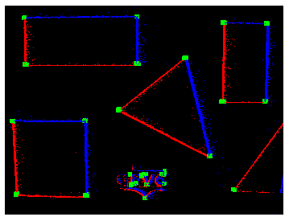
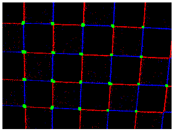

# Event-Based Harris Corner Detection

This code implements the algorithm presented by Valentina Vasco, Arren Glover, and Chiara Bartolozzi in the article *Fast event-based harris corner detection exploiting the advantages of event-driven cameras*.

## Experiment 1: Geometry
### Setup

### Result

## Experiment 2: Chessboard
### Setup

### Result

