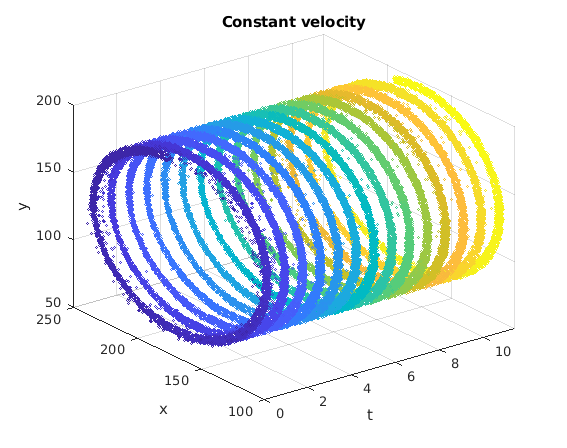
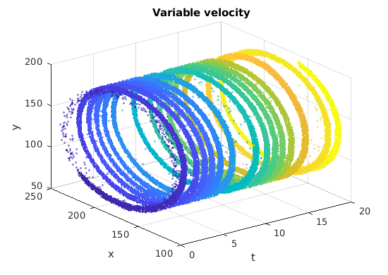

# Wheel Demo

This demo is inspired by *Event-based, 6-DOF pose tracking for high-speed maneuvers* by Elias Mueggler, Basil Huber and Davide Scaramuzza.

## Demo 1: Constant velocity
### Setup

### Result

## Demo 2: Variable velocity
### Setup

### Result

